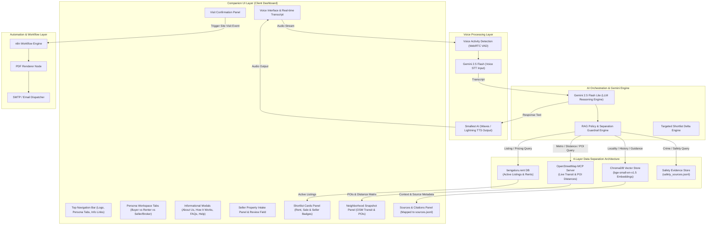

# Voice-First AI Property Scout — Technical Architecture & Implementation Plan

> **Version:** 2.3.0 (Master Architecture Plan with Gemini 2.5 Flash/Lite & Smallest AI Stack)  
> **Status:** Approved Technical Design Blueprint  
> **Source Grounding:** [Docs/problemstatement.md](file:///Users/arshmaheshwari/Final%20Graduation%20Project%20Property/Docs/problemstatement.md) & [gemini.md](file:///Users/arshmaheshwari/Final%20Graduation%20Project%20Property/gemini.md)

---

## 1. Executive Summary & Vision

The **Voice-First AI Property Scout** is a multi-persona, evidence-grounded real estate intelligence platform built for the Bengaluru property market. Unlike conventional portals that force users through rigid dropdown filters and unverified metadata, this solution provides:

1. **Multi-Role Persona Switching:** Dynamically shifts AI dialogue state, input forms, financial calculations, and search rules across three user roles: **Buyer**, **Renter**, and **Seller / Landlord / Broker**.
2. **Strict Separation of Responsibilities across 4 Data Engines:**
   - **`bengaluru.rent`**: Current listings, rent prices, and availability. (Never queried from RAG).
   - **`RAG Knowledge Store` (`localities.jsonl`, `sources.jsonl`, `Readme.md`)**: Verified neighborhood history, character, development, and context.
   - **`Safety Evidence Engine` (`safety_sources.jsonl`)**: Crime stats with strict non-binary safety handling.
   - **`OpenStreetMap MCP`**: Real-time spatial POI, transit, metro station, and distance calculations.
3. **Primary Voice & AI Model Architecture:**
   - **Voice Input (STT):** **Gemini 2.5 Flash** (Multimodal native audio input for fast, high-accuracy speech transcription).
   - **LLM Reasoning Engine:** **Gemini 2.5 Flash Lite** (High-speed, cost-efficient reasoning & grounded response generation).
   - **Voice Output (TTS):** **Smallest AI** (Waves / Lightning API — ultra-low latency <100ms speech synthesis).
   - **Embedding Model:** **`BAAI/bge-small-en-v1.5`** (384-dimensional dense vectors via FastEmbed running 100% free locally in <5ms).
4. **n8n PDF & Email Automation:** Automated post-booking workflow compiling personalized shortlist reports into PDFs and delivering them via email.

---

## 2. High-Level Architecture & Separation Matrix

---

## 3. Technology Stack Specification

| Component | Technology Choice | Function / Purpose |
| :--- | :--- | :--- |
| **Voice Input (STT)** | **Gemini 2.5 Flash** | Multimodal audio speech-to-text transcription |
| **LLM Reasoning** | **Gemini 2.5 Flash Lite** | Fast, grounded dialogue & JSON response generation |
| **Voice Output (TTS)** | **Smallest AI** (Lightning API) | Ultra-low latency (<100ms) natural speech synthesis |
| **Embedding Engine** | **`BAAI/bge-small-en-v1.5`** (FastEmbed) | 384-dim local dense vector embeddings (<5ms) |
| **Vector DB** | **ChromaDB** | Local persistent vector storage (`./data/chroma_db`) |
| **Spatial MCP** | **OpenStreetMap MCP** | Real-time transit, POIs, and metro distances |
| **Automation** | **n8n Workflow Engine** | PDF generation and email delivery (`site_visit_pdf_workflow.json`) |
