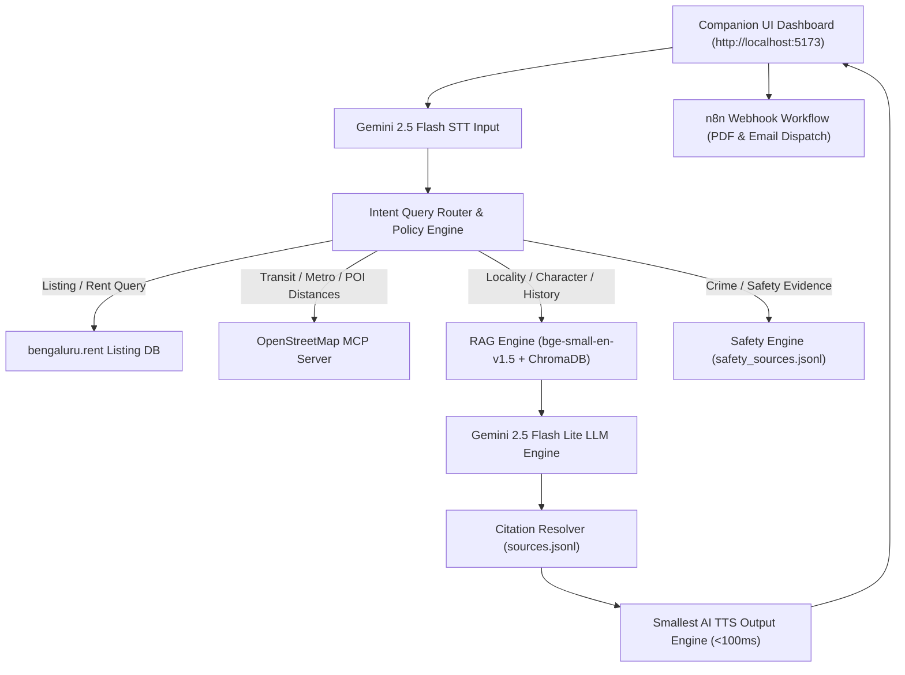
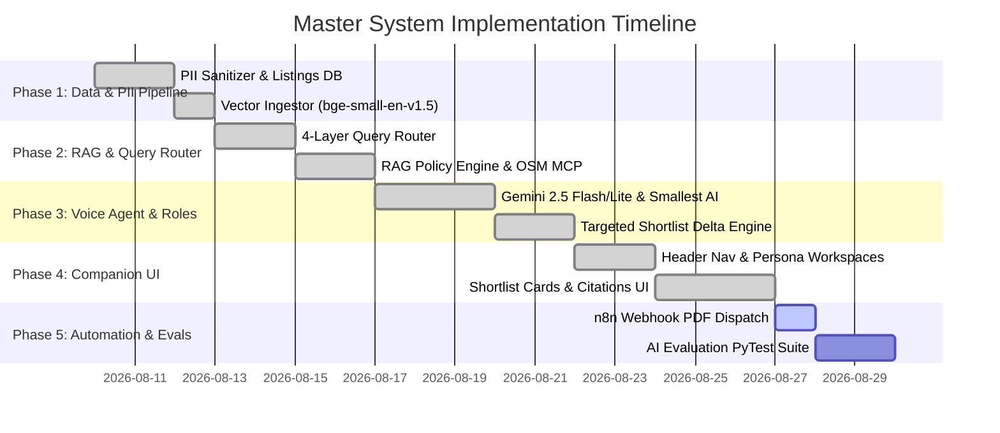

# Voice-First AI Property Scout — Master Technical Implementation Plan

> **Source Documents:** [Docs/problemstatement.md](file:///Users/arshmaheshwari/Final%20Graduation%20Project%20Property/Docs/problemstatement.md) & [architectureplan.md](file:///Users/arshmaheshwari/Final%20Graduation%20Project%20Property/architectureplan.md)  
> **Status:** Active Master Technical Blueprint (Phases 1-4 Completed & Verified)

---

## 📌 Architectural Principles & Separation Matrix

> [!IMPORTANT]
> **Strict 4-Layer Separation of Responsibilities:**
> 1. **`bengaluru.rent`**: Source of truth for current property listings, prices, and active availability. (RAG is NEVER used for current rents or listings).
> 2. **`RAG Knowledge Store` (`localities.jsonl`, `sources.jsonl`, `Readme.md`)**: Source of truth for neighborhood history, character, development, and context.
> 3. **`Safety Evidence Engine` (`safety_sources.jsonl`)**: Source of truth for crime statistics. (Binary "safe" or "unsafe" ratings are STRICTLY FORBIDDEN).
> 4. **`OpenStreetMap MCP`**: Source of truth for live transit, metro stations, POIs, and distance calculations. (RAG is NEVER used for exact distances).

---

## 🛠️ Complete 5-Phase Implementation Roadmap

---

## 📂 Detailed File-by-File Breakdown Across All 5 Phases

### 🔹 Phase 1: Data Pipeline & Knowledge Base Ingestion `[COMPLETED & VERIFIED]`

#### 1. [src/data/pii_scrubber.py](file:///Users/arshmaheshwari/Final%20Graduation%20Project%20Property/src/data/pii_scrubber.py)
- **Status:** `[DONE]`
- **Purpose:** Strips owner/agent names, phone numbers (`[REDACTED_PHONE]`), and emails (`[REDACTED_EMAIL]`) from property listings.

#### 2. [data/listings.json](file:///Users/arshmaheshwari/Final%20Graduation%20Project%20Property/data/listings.json)
- **Status:** `[DONE]`
- **Purpose:** Clean active seed property listings for Bengaluru (`bengaluru.rent` schema).

#### 3. [src/data/listings_db.py](file:///Users/arshmaheshwari/Final%20Graduation%20Project%20Property/src/data/listings_db.py)
- **Status:** `[DONE]`
- **Purpose:** Pre-filters active listings and exposes filtering by rent/sale price, BHK, sqft, furnishing, and locality.

#### 4. [src/grounding/kb_ingestor.py](file:///Users/arshmaheshwari/Final%20Graduation%20Project%20Property/src/grounding/kb_ingestor.py)
- **Status:** `[DONE]`
- **Purpose:** Parses `sources.jsonl`, `localities.jsonl` (82 locality profiles), `safety_sources.jsonl`, and `Readme.md` into ChromaDB using **`BAAI/bge-small-en-v1.5`** embeddings.

---

### 🔹 Phase 2: Intent Query Router, Weighted RAG & OpenStreetMap MCP `[COMPLETED & VERIFIED]`

#### 5. [src/grounding/query_router.py](file:///Users/arshmaheshwari/Final%20Graduation%20Project%20Property/src/grounding/query_router.py)
- **Status:** `[DONE]`
- **Purpose:** Classifies user query intent across the 4 separation layers (`LISTING_PRICING`, `LIVE_TRANSIT_POI`, `NEIGHBORHOOD_CONTEXT`, `CRIME_SAFETY`).

#### 6. [src/grounding/citation_resolver.py](file:///Users/arshmaheshwari/Final%20Graduation%20Project%20Property/src/grounding/citation_resolver.py)
- **Status:** `[DONE]`
- **Purpose:** Resolves source IDs (`SRC_WIKI_NEIGHBORHOODS`, `SRC_GBA`, `SRC_KAR_POLICE_CRIME_2025`, `SRC_OSM_MCP`) to rich metadata in `Docs/sources.jsonl`.

#### 7. [src/grounding/osm_mcp_client.py](file:///Users/arshmaheshwari/Final%20Graduation%20Project%20Property/src/grounding/osm_mcp_client.py)
- **Status:** `[DONE]`
- **Purpose:** OpenStreetMap MCP connector querying live POIs, bus stops, supermarkets, hospitals, and Namma Metro station distances.

#### 8. [src/grounding/weighted_rag_engine.py](file:///Users/arshmaheshwari/Final%20Graduation%20Project%20Property/src/grounding/weighted_rag_engine.py)
- **Status:** `[DONE]`
- **Purpose:** Vector retrieval with **Metadata Pre-Filtering** (`locality == query_locality`) and **Weighted Cosine Scoring** ($\text{Relevance Score} = \text{CosineSimilarity} \times \text{SourceWeight}$).

#### 9. [src/grounding/rag_policy_engine.py](file:///Users/arshmaheshwari/Final%20Graduation%20Project%20Property/src/grounding/rag_policy_engine.py)
- **Status:** `[DONE]`
- **Purpose:** Enforces 15 RAG Policy Rules, non-binary safety guardrails, and data absence fallbacks (*"I don't have enough verified information to make that claim."*).

---

### 🔹 Phase 3: Voice Agent & Multi-Persona Dialogue Engine `[COMPLETED & VERIFIED]`

#### 10. [src/agent/gemini_agent.py](file:///Users/arshmaheshwari/Final%20Graduation%20Project%20Property/src/agent/gemini_agent.py)
- **Status:** `[DONE]`
- **Purpose:** Connects to Gemini API using **Gemini 2.5 Flash** for audio STT and **Gemini 2.5 Flash Lite** for LLM grounded dialogue reasoning.

#### 11. [src/agent/smallest_tts.py](file:///Users/arshmaheshwari/Final%20Graduation%20Project%20Property/src/agent/smallest_tts.py)
- **Status:** `[DONE]`
- **Purpose:** Connects to **Smallest AI Waves / Lightning TTS API** for ultra-low latency (<100ms) speech audio synthesis.

#### 12. [src/agent/dialogue_manager.py](file:///Users/arshmaheshwari/Final%20Graduation%20Project%20Property/src/agent/dialogue_manager.py)
- **Status:** `[DONE]`
- **Purpose:** Role-aware state machine managing conversations across **Buyer Mode**, **Renter Mode**, and **Seller / Landlord / Broker Mode**.

#### 13. [src/agent/delta_engine.py](file:///Users/arshmaheshwari/Final%20Graduation%20Project%20Property/src/agent/delta_engine.py)
- **Status:** `[DONE]`
- **Purpose:** Targeted shortlist delta modification engine executing voice edits (e.g. *"drop properties above 40k"*) targeting affected listings without disturbing untouched entries.

---

### 🔹 Phase 4: Companion UI Dashboard (Frontend Components) `[COMPLETED & VERIFIED]`

#### 14. [src/components/HeaderNav.jsx](file:///Users/arshmaheshwari/Final%20Graduation%20Project%20Property/src/components/HeaderNav.jsx)
- **Status:** `[DONE]`
- **Purpose:** Renders branding logo, unified Persona Workspace Tabs (`Buyer Mode`, `Renter & Seller Mode`), Locality selector, and View Mode switchers (`Command View`, `GIS Radar Map`, `Compare Matrix`, `Architecture Spec`).

#### 15. [src/components/VoiceHUD.jsx](file:///Users/arshmaheshwari/Final%20Graduation%20Project%20Property/src/components/VoiceHUD.jsx)
- **Status:** `[DONE]`
- **Purpose:** Voice Agent HUD with real-time audio waveform visualizer, interactive microphone button, live transcript drawer, voice shortcut chips, and audio playback.

#### 16. [src/components/PropertyCard.jsx](file:///Users/arshmaheshwari/Final%20Graduation%20Project%20Property/src/components/PropertyCard.jsx)
- **Status:** `[DONE]`
- **Purpose:** Property listing cards displaying asking price/rent, deposit/EMI, BHK, sqft, furnishing, RERA standing, `[Seller Note - 0.3 weight]` tags, comparison toggle, and site visit trigger.

#### 17. [src/components/NeighborhoodTelemetry.jsx](file:///Users/arshmaheshwari/Final%20Graduation%20Project%20Property/src/components/NeighborhoodTelemetry.jsx)
- **Status:** `[DONE]`
- **Purpose:** Displays spatial transit proximity metrics (nearest metro distance, isochrone walking time, tech park commute times, safety illumination index) from OpenStreetMap MCP.

#### 18. [src/components/SpatialRadarMap.jsx](file:///Users/arshmaheshwari/Final%20Graduation%20Project%20Property/src/components/SpatialRadarMap.jsx)
- **Status:** `[DONE]`
- **Purpose:** Mode B — Interactive GIS Radar Map with Bengaluru locality coordinates, Namma Metro Purple & Green line tracks, tech corridor commute arcs, 500m/1.5km isochrone rings, and property pins with floating Scout Dossiers.

#### 19. [src/components/PropertyComparisonMatrix.jsx](file:///Users/arshmaheshwari/Final%20Graduation%20Project%20Property/src/components/PropertyComparisonMatrix.jsx)
- **Status:** `[DONE]`
- **Purpose:** Mode C — Side-by-side metric comparison table evaluating up to 3 selected properties with "Best Value" and "Nearest Metro" badges.

#### 20. [src/components/DesignSystemShowcase.jsx](file:///Users/arshmaheshwari/Final%20Graduation%20Project%20Property/src/components/DesignSystemShowcase.jsx)
- **Status:** `[DONE]`
- **Purpose:** Mode D — Interactive Design System & 4-Layer RAG Separation Matrix Explorer (`bengaluru.rent`, `localities.jsonl`, `safety_sources.jsonl`, `OpenStreetMap MCP`).

#### 21. [src/components/SellerIntakePanel.jsx](file:///Users/arshmaheshwari/Final%20Graduation%20Project%20Property/src/components/SellerIntakePanel.jsx) & [SellerListingsWorkspace.jsx](file:///Users/arshmaheshwari/Final%20Graduation%20Project%20Property/src/components/SellerListingsWorkspace.jsx)
- **Status:** `[DONE]`
- **Purpose:** Seller & Landlord Intelligence Hub (+ List Property form, Market Demand Index, Smart Early Discount Calculator, Buyer Attraction Tips, My Listed Properties workspace, active buyer/tenant leads).

#### 22. [src/components/SourcesDrawer.jsx](file:///Users/arshmaheshwari/Final%20Graduation%20Project%20Property/src/components/SourcesDrawer.jsx)
- **Status:** `[DONE]`
- **Purpose:** Displays clickable visual citations showing exact source name, ID, type, and URL resolved via `citation_resolver.py`.

#### 23. [src/components/BookingModal.jsx](file:///Users/arshmaheshwari/Final%20Graduation%20Project%20Property/src/components/BookingModal.jsx) & [InfoModals.jsx](file:///Users/arshmaheshwari/Final%20Graduation%20Project%20Property/src/components/InfoModals.jsx)
- **Status:** `[DONE]`
- **Purpose:** Site visit scheduling with simulated n8n automated PDF dossier dispatch workflow, plus About, How It Works, and FAQs modals.

---

### 🔹 Phase 5: Automation & AI Evaluation Suite `[NEXT PHASE]`

#### 24. [src/automation/n8n_client.py](file:///Users/arshmaheshwari/Final%20Graduation%20Project%20Property/src/automation/n8n_client.py)
- **Status:** `[PLANNED]`
- **Purpose:** Triggers n8n Webhook `POST /webhook/site-visit-booked` upon site visit confirmation.

#### 25. [workflows/site_visit_pdf_workflow.json](file:///Users/arshmaheshwari/Final%20Graduation%20Project%20Property/workflows/site_visit_pdf_workflow.json)
- **Status:** `[PLANNED]`
- **Purpose:** Production n8n workflow compiling site visit confirmation into a formatted PDF and emailing it to the user.

#### 26. [tests/evals/test_feasibility_eval.py](file:///Users/arshmaheshwari/Final%20Graduation%20Project%20Property/tests/evals/test_feasibility_eval.py), [test_seller_intake_eval.py](file:///Users/arshmaheshwari/Final%20Graduation%20Project%20Property/tests/evals/test_seller_intake_eval.py), [test_rag_policy_eval.py](file:///Users/arshmaheshwari/Final%20Graduation%20Project%20Property/tests/evals/test_rag_policy_eval.py)
- **Status:** `[PLANNED]`
- **Purpose:** Automated evaluation suite verifying budget feasibility, seller intake extractions, and RAG policy compliance.
