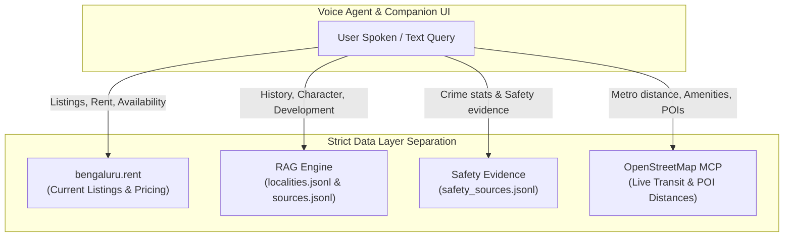

# Voice-First AI Property Scout — Problem Statement

> **Objective:** Build a voice-first AI property scout that understands a renter, landlord, or broker's spoken input, shortlists real rental listings or lists new rental properties, adapts its conversational agent persona based on the active user role (Renter Mode vs Landlord/Seller Mode), explains decisions using verified RAG grounding (from structured `localities.jsonl`, `sources.jsonl`, and `safety_sources.jsonl` files), strictly separates spatial queries to OpenStreetMap MCP, and books site visits or logs new property listings, supported by a full-fledged companion UI with platform information.

---

## 📌 Problem Statement

People don't struggle to find or post rental listings. They struggle to evaluate whether a listing actually fits their life and goals:
- *Is the commute realistic during peak hours?*
- *Is the area safe at night?*
- *For Renters:* Is it worth paying extra rent for an extra room or better amenities?
- *For Landlords/Sellers/Brokers:* How to quickly list a rental property via voice and highlight custom amenities without creating biased/unverified claims for prospective renters?

Standard property portals present static search filters and unverified raw data, lacking conversational intelligence, role-based reasoning, strict separation of responsibilities, contextual neighborhood grounding, and transparent citation enforcement.

---

## 🎯 Task Overview

You are required to build a voice-based AI assistant with a companion UI featuring **Multi-Persona Workspace Tabs (Renter Mode vs Seller / Landlord / Broker Mode)**, **Strict 4-Source Separation Architecture**, and **Verified RAG Policy Enforcement** that:

1. **Supports Multi-User Personas via Workspace Tabs:**
   - **Renter Mode:** Voice agent adapts to renters (focusing on monthly rent, security deposit, lock-in period, tenant restrictions, immediate availability, and fast shortlist comparison). Home purchase/buying queries are out-of-scope; the platform specializes exclusively in verified rental property discovery.
   - **Seller / Landlord / Broker Mode:** Voice agent acts as an automated property intake assistant, collecting listing details via voice (*location, asking monthly rent, BHK, sqft, furnishing, amenities*) AND capturing a **Seller Property Review/Highlights note**.
2. **Implements Strict Separation of Responsibilities across 4 Data Layers:**
   - **`bengaluru.rent`**: Source of truth for current rental property/listing data, rents, and availability. (RAG is NEVER used for current rents or listings).
   - **`RAG Knowledge Base` (`localities.jsonl`, `sources.jsonl`, `Readme.md`)**: Source of truth for verified neighborhood context, history, development, and broad character.
   - **`Safety Sources` (`safety_sources.jsonl`)**: Source of truth for crime/safety evidence. (Binary "safe" or "unsafe" ratings are STRICTLY FORBIDDEN unless explicitly supported by crime stats).
   - **`OpenStreetMap MCP`**: Source of truth for transit, metro stations, exact distances, POIs, schools, hospitals, and parks. (RAG is NEVER used for exact distances or live transit).
3. **Applies Strict RAG Retrieval Policy & Zero-Hallucination Guardrails:**
   - Retrieves locality context ONLY for neighborhood character, history, development, or guidance.
   - Never infers facts across localities.
   - If sufficient verified evidence does not exist, explicitly states: *"I don't have enough verified information to make that claim."*
   - Displays exact, traceable source citations in the UI mapping to metadata in `sources.jsonl`.
   - Never cites un-retrieved or fabricated sources.
4. **Provides Comprehensive Platform Information (Header / Modal Views):**
   - **About Us**, **How It Works**, **FAQs**, and **Help & Support** panels embedded in the UI navigation.
5. **Shortlists real listings, explains decisions, and books site visits** triggering automated n8n PDF & email delivery.

---

## 🚀 Core Capabilities & Separation of Responsibilities

### 1. Separation of Responsibilities Matrix

| Domain / Query Type | Responsible Engine | Forbidden Engine / Negative Constraint |
| :--- | :--- | :--- |
| **Current Listings & Rent Prices** | `bengaluru.rent` | ❌ NEVER query RAG for current property prices or listings. |
| **Neighborhood History & Character** | `localities.jsonl` via RAG | ❌ NEVER use LLM parametric memory or extrapolate across localities. |
| **Safety & Crime Evidence** | `safety_sources.jsonl` via RAG | ❌ NEVER produce binary "safe" / "unsafe" claims without explicit stats. |
| **Transit, Metro & POI Distances** | `OpenStreetMap MCP` | ❌ NEVER use RAG or LLM to estimate exact distances or commute times. |

---

## 📚 Grounding & RAG Retrieval Policy Rules

1. **Selective Retrieval:** Retrieve locality context ONLY when the user asks about neighborhood character, background, development, history, or guidance.
2. **Zero Listing/Price RAG:** Never use RAG for current property availability, rent, or sale prices.
3. **Geospatial Exclusivity:** Always use OpenStreetMap MCP for metro stations, transit, restaurants, hospitals, schools, parks, and POI distance calculations.
4. **Non-Binary Safety Guardrail:** When asked *"Is Koramangala safe?"*, retrieve safety evidence from `safety_sources.jsonl`. Do NOT output binary "safe" or "unsafe" ratings unless supported by explicit data.
5. **Transparent Absence Handling:** If sufficient evidence is missing, output explicitly: *"I don't have enough verified information to make that claim."*
6. **No Cross-Locality Inference:** Never infer a fact about one locality merely because the same fact exists for another locality.
7. **Traceable UI Citations:** Every factual claim derived from RAG must expose its source citation (mapped from `sources.jsonl`) in the UI.
8. **Disagreement Resolution:** When retrieved sources disagree, surface the uncertainty/disagreement explicitly and cite both sources.
9. **Metadata Preservation:** Ingest and preserve `source_id`, `name`, `type`, `role`, `reliability_note`, and `verified` timestamp with every vector chunk.

---

## 🖥️ Companion UI Requirements

| UI Component | Requirements & Features |
| :--- | :--- |
| **Top Navigation Bar** | Platform Header featuring Logo, Persona Workspace Tabs (`Buyer`, `Renter`, `Seller`), and Info Links (`About Us`, `How It Works`, `FAQs`, `Help`). |
| **Informational Modals** | Drawers for About Us, How It Works (4-step diagram), FAQs accordion, and Help & Support (voice cheat-sheet). |
| **Seller Property Intake Panel** | Form & Voice Intake UI for Sellers/Brokers with location, price, specs, and multiline **Seller Review Notes** box (weighted 0.3 in RAG). |
| **Shortlist Cards** | Displays rent/sale price, BHK, sqft, furnishing, availability, amenities, and `[Seller Note]` badge. |
| **Neighborhood Snapshot Panel** | Spatial transit proximity metrics (metro distance, bus stops, hospitals, parks) retrieved via **OpenStreetMap MCP**. |
| **Voice Interface & Live Transcript** | Interactive mic button paired with real-time STT transcript and active role indicator. |
| **Sources & References Panel** | Verified visual citations showing exact source name, ID, type, and URL resolved from `sources.jsonl`. |
| **Visit Confirmation Panel** | Scheduled slot details, address, booking ID, and PDF export option. |

---

## 📦 Summary of Deliverables

- [ ] Deployed voice-first web prototype with **Buyer, Renter, and Seller Tabs** (public URL)
- [ ] Ingested RAG Knowledge Base (`localities.jsonl`, `sources.jsonl`, `safety_sources.jsonl`, `Readme.md`)
- [ ] Integration demonstration of **OpenStreetMap MCP** tool for spatial POI & transit distance calculations
- [ ] Automated n8n workflow for PDF generation & email dispatch (`workflows/site_visit_pdf_workflow.json`)
- [ ] Runnable AI Evaluation suite (Feasibility, Persona Intake, Grounding & Safety Policy Verification)
