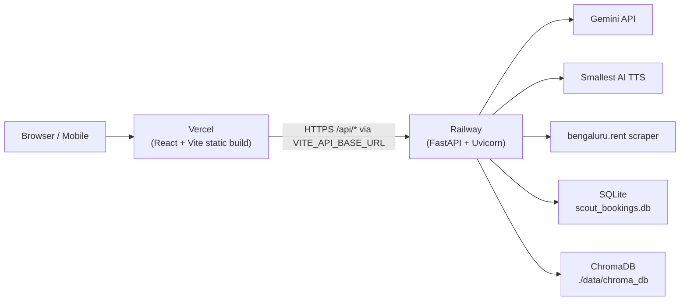

# SCOUT.AI — Deployment Plan

**Goal:** Deploy the **React/Vite frontend** on **Vercel** and the **FastAPI backend** on **Railway**, with a clear split between static UI and API services.

---

## 1. Architecture Overview



| Layer | Platform | Runtime | Public URL example |
|---|---|---|---|
| Frontend | Vercel | Static SPA (`dist/`) | `https://scout-ai.vercel.app` |
| Backend API | Railway | Python 3.11 + Uvicorn | `https://scout-api.up.railway.app` |

---

## 2. Pre-Deployment Checklist

Complete these **before** pushing to production.

### 2.1 Frontend — replace hardcoded `localhost:8000`

The app currently calls the API at `http://localhost:8000` in:

- `src/App.jsx`
- `src/utils/siteVisitBooking.js`

**Action:** Introduce a single API base URL helper and use Vite env vars.

Create `src/utils/apiBase.js`:

```js
export const API_BASE = import.meta.env.VITE_API_BASE_URL || '';
```

Update all fetch calls from:

```js
fetch('http://localhost:8000/api/listings')
```

to:

```js
fetch(`${API_BASE}/api/listings`)
```

In local dev, keep the Vite proxy in `vite.config.js` and set `VITE_API_BASE_URL=` (empty string) so `/api` proxies to `localhost:8000`.

In production on Vercel, set:

```env
VITE_API_BASE_URL=https://your-railway-app.up.railway.app
```

### 2.2 Backend — add Python dependency manifest

The repo has no `requirements.txt` yet. Create one at the project root:

```txt
fastapi>=0.110.0
uvicorn[standard]>=0.27.0
pydantic>=2.0.0
google-generativeai>=0.8.0
fastembed>=0.3.0
chromadb>=0.4.0
requests>=2.31.0
google-auth>=2.0.0
google-auth-oauthlib>=1.0.0
google-api-python-client>=2.0.0
```

Pin exact versions after a successful local `pip install -r requirements.txt` smoke test.

### 2.3 Backend — bind to Railway `PORT`

Railway injects a dynamic `PORT`. Update the production start command to:

```bash
uvicorn src.api.main:app --host 0.0.0.0 --port $PORT
```

Do **not** hardcode port `8000` in production.

### 2.4 CORS — restrict to your Vercel domain

In `src/api/main.py`, replace `allow_origins=["*"]` with:

```python
import os

ALLOWED_ORIGINS = os.getenv(
    "CORS_ALLOWED_ORIGINS",
    "http://localhost:5173,https://your-app.vercel.app"
).split(",")

app.add_middleware(
    CORSMiddleware,
    allow_origins=ALLOWED_ORIGINS,
    allow_credentials=True,
    allow_methods=["*"],
    allow_headers=["*"],
)
```

Set on Railway:

```env
CORS_ALLOWED_ORIGINS=https://your-app.vercel.app,https://your-custom-domain.com
```

### 2.5 Persist SQLite bookings on Railway

`data/scout_bookings.db` stores broker site-visit bookings. Railway containers are ephemeral unless you attach a volume.

**Recommended:** Add a Railway **Volume** mounted at `/data` and set:

```env
BOOKINGS_DB_PATH=/data/scout_bookings.db
```

Then update `src/data/broker_booking_db.py` to read `DB_PATH` from that env var (currently hardcoded to `data/scout_bookings.db`).

Without a volume, bookings reset on every redeploy.

### 2.6 Commit bundled data files

Ensure these are in git (they already are):

- `data/listings.json` — property catalog fallback
- `Docs/localities.jsonl`, `Docs/sources.jsonl`, `Docs/safety_sources.jsonl` — RAG sources
- `public/mascot.png` — mascot asset

ChromaDB (`data/chroma_db/`) is gitignored. On first Railway boot it will be rebuilt from ingestion scripts, or you can run ingestion once and attach a volume.

---

## 3. Deploy Backend on Railway

### 3.1 Prerequisites

- [Railway account](https://railway.app)
- GitHub repo connected to Railway
- API keys ready (see Section 5)

### 3.2 Create the Railway service

1. **New Project → Deploy from GitHub repo**
2. Select this repository
3. Railway auto-detects Python if `requirements.txt` exists at root

### 3.3 Configure build & start

**Root directory:** `/` (repo root — Python imports use `src.*`)

**Build command** (optional — Railway often auto-installs):

```bash
pip install -r requirements.txt
```

**Start command:**

```bash
uvicorn src.api.main:app --host 0.0.0.0 --port $PORT
```

Alternatively, create `railway.toml` at repo root:

```toml
[build]
builder = "NIXPACKS"

[deploy]
startCommand = "uvicorn src.api.main:app --host 0.0.0.0 --port $PORT"
healthcheckPath = "/api/health"
healthcheckTimeout = 120
restartPolicyType = "ON_FAILURE"
```

### 3.4 Environment variables (Railway dashboard)

Add all variables from Section 5 under **Variables**.

Critical minimum for a working API:

| Variable | Required | Notes |
|---|---|---|
| `GEMINI_API_KEY` | Yes | LLM + STT reasoning |
| `PORT` | Auto | Injected by Railway — do not override |
| `CORS_ALLOWED_ORIGINS` | Yes | Your Vercel URL(s) |

Optional but recommended:

| Variable | Purpose |
|---|---|
| `SMALLEST_API_KEY` | Server-side TTS (frontend uses Web Speech fallback if absent) |
| `SMTP_HOST`, `SMTP_PORT`, `SMTP_USER`, `SMTP_PASSWORD`, `SENDER_EMAIL` | Site-visit confirmation emails |
| `N8N_WEBHOOK_URL` | PDF/email automation webhook |
| `BOOKINGS_DB_PATH` | Persistent SQLite path when using a volume |

### 3.5 Generate public domain

1. Railway project → **Settings → Networking → Generate Domain**
2. Copy the URL, e.g. `https://scout-api-production.up.railway.app`
3. Use this as `VITE_API_BASE_URL` on Vercel

### 3.6 Verify backend

```bash
curl https://your-railway-app.up.railway.app/api/health
```

Expected response:

```json
{
  "status": "healthy",
  "active_persona": "Renter",
  "listings_count": 148,
  "brokers_count": 8
}
```

Also test:

```bash
curl https://your-railway-app.up.railway.app/api/listings
```

---

## 4. Deploy Frontend on Vercel

### 4.1 Prerequisites

- [Vercel account](https://vercel.com)
- GitHub repo connected to Vercel
- Railway backend URL from Section 3.5

### 4.2 Import project

1. **Add New → Project → Import Git Repository**
2. Select this repo
3. Vercel auto-detects **Vite**

### 4.3 Build settings

| Setting | Value |
|---|---|
| **Framework Preset** | Vite |
| **Root Directory** | `./` |
| **Build Command** | `npm run build` |
| **Output Directory** | `dist` |
| **Install Command** | `npm install` |
| **Node.js Version** | 20.x |

Optional `vercel.json` at repo root:

```json
{
  "buildCommand": "npm run build",
  "outputDirectory": "dist",
  "framework": "vite",
  "rewrites": [
    { "source": "/(.*)", "destination": "/index.html" }
  ]
}
```

The rewrite rule ensures client-side routing works if you add routes later.

### 4.4 Environment variables (Vercel dashboard)

| Variable | Value | Environment |
|---|---|---|
| `VITE_API_BASE_URL` | `https://your-railway-app.up.railway.app` | Production |
| `VITE_API_BASE_URL` | `` (empty) | Preview (uses Vite proxy if running locally) or set to a staging Railway URL |

> Vite only exposes env vars prefixed with `VITE_` to the browser. Never put secret API keys in Vercel frontend env vars.

### 4.5 Deploy

Click **Deploy**. Vercel builds `dist/` and serves it globally on CDN.

Production URL example: `https://scout-ai.vercel.app`

### 4.6 Update Railway CORS

After Vercel deploys, add the live Vercel URL to Railway:

```env
CORS_ALLOWED_ORIGINS=https://scout-ai.vercel.app
```

Redeploy Railway if CORS was configured before the Vercel URL existed.

### 4.7 Verify frontend

1. Open the Vercel URL — landing page loads with **Launch AI Agent** visible
2. Click **Launch AI Agent** — command view opens
3. Open browser DevTools → Network — confirm API calls go to Railway, not `localhost:8000`
4. Test site-visit booking modal — broker availability calls `/api/brokers/availability`

---

## 5. Full Environment Variable Reference

### Railway (Backend)

```env
# ── AI Engines ──
GEMINI_API_KEY=your_gemini_api_key
GEMINI_LLM_MODEL=gemini-2.5-flash-lite
GEMINI_STT_MODEL=gemini-2.5-flash
SMALLEST_API_KEY=your_smallest_ai_api_key
SMALLEST_TTS_MODEL=lightning
SMALLEST_VOICE_ID=emily

# ── Optional Groq fallback ──
GROQ_API_KEY=your_groq_api_key
GROQ_LLM_MODEL=llama-3.3-70b-versatile
GROQ_STT_MODEL=whisper-large-v3-turbo

# ── RAG / Vector store ──
EMBEDDING_MODEL_NAME=BAAI/bge-small-en-v1.5
VECTOR_STORE_PATH=./data/chroma_db

# ── Engine selection ──
LLM_ENGINE=gemini_flash_lite
STT_ENGINE=gemini_flash
TTS_ENGINE=smallest_ai

# ── CORS (required in production) ──
CORS_ALLOWED_ORIGINS=https://your-app.vercel.app

# ── Email (site visit confirmations) ──
SMTP_HOST=smtp.gmail.com
SMTP_PORT=587
SMTP_USER=your@gmail.com
SMTP_PASSWORD=your_app_password
SENDER_EMAIL=support@scout.ai

# ── Automation ──
N8N_WEBHOOK_URL=https://your-n8n-instance/webhook/site-visit-booked

# ── Persistence (with Railway volume) ──
BOOKINGS_DB_PATH=/data/scout_bookings.db
```

### Vercel (Frontend)

```env
VITE_API_BASE_URL=https://your-railway-app.up.railway.app
```

---

## 6. Recommended Deployment Order

```text
1. Create requirements.txt + railway.toml
2. Fix API base URL in frontend (VITE_API_BASE_URL)
3. Tighten CORS in FastAPI
4. Deploy Railway backend → get public URL
5. curl /api/health on Railway
6. Set VITE_API_BASE_URL on Vercel
7. Deploy Vercel frontend
8. Update CORS_ALLOWED_ORIGINS with Vercel URL
9. End-to-end smoke test (listings, voice flow, site visit)
```

---

## 7. Post-Deploy Smoke Test Checklist

| # | Test | Pass criteria |
|---|---|---|
| 1 | `GET /api/health` | Returns `"status": "healthy"` |
| 2 | `GET /api/listings` | Returns property array |
| 3 | Landing page load | Hero + Launch button visible without scroll |
| 4 | Launch AI Agent | Command view opens, no console CORS errors |
| 5 | Property cards | Listings render from Railway API |
| 6 | Site visit modal | Broker slots load from `/api/brokers/availability` |
| 7 | Voice Speak button | Mic permission + Web Speech works in HTTPS (Vercel provides SSL) |
| 8 | Purchase intent | "I want to buy" declined; "I want to rent" continues flow |

---

## 8. Custom Domain (Optional)

### Vercel (frontend)

1. Vercel project → **Settings → Domains**
2. Add `scout.ai` or `app.scout.ai`
3. Update DNS per Vercel instructions

### Railway (backend)

1. Railway → **Settings → Networking → Custom Domain**
2. Add `api.scout.ai`
3. Update `VITE_API_BASE_URL` on Vercel to `https://api.scout.ai`
4. Update `CORS_ALLOWED_ORIGINS` on Railway to include your Vercel custom domain

---

## 9. CI / Preview Environments

### Vercel Preview Deployments

Every pull request gets a preview URL automatically. For previews that hit a real API:

- Create a **Railway staging service** (duplicate project)
- Set Vercel **Preview** env: `VITE_API_BASE_URL=https://scout-api-staging.up.railway.app`

### GitHub Actions (optional)

Run tests before deploy:

```yaml
name: CI
on: [push, pull_request]
jobs:
  test:
    runs-on: ubuntu-latest
    steps:
      - uses: actions/checkout@v4
      - uses: actions/setup-node@v4
        with:
          node-version: 20
      - run: npm ci
      - run: npm run test:intent
      - run: npm run test:voice-interrupt
      - uses: actions/setup-python@v5
        with:
          python-version: "3.11"
      - run: pip install -r requirements.txt
      - run: python3 -m pytest tests/evals/ -q
```

---

## 10. Troubleshooting

| Symptom | Likely cause | Fix |
|---|---|---|
| CORS error in browser | Railway `CORS_ALLOWED_ORIGINS` missing Vercel URL | Add exact origin, redeploy Railway |
| API calls still go to `localhost:8000` | Frontend not using `VITE_API_BASE_URL` | Fix fetch URLs; redeploy Vercel |
| `502 Bad Gateway` on Railway | Wrong start command or crash on boot | Check Railway logs; verify `uvicorn src.api.main:app` |
| Empty listings | Scraper failed on startup | Check logs; ensure `data/listings.json` is committed |
| Bookings lost after redeploy | No persistent volume | Attach Railway volume + set `BOOKINGS_DB_PATH` |
| Voice mic blocked | Not served over HTTPS | Vercel provides HTTPS by default — ensure you're not on `http://` |
| ChromaDB empty / slow cold start | `data/chroma_db` not persisted | Run ingestion once or mount volume; expect first boot delay |
| Gemini errors | Missing or invalid `GEMINI_API_KEY` | Set key in Railway variables |

---

## 11. Cost & Performance Notes

| Service | Free tier | Notes |
|---|---|---|
| **Vercel** | Hobby plan covers personal projects | Static frontend is cheap; CDN included |
| **Railway** | $5/month credit on free trial | FastAPI + ChromaDB + scraper may need paid plan for 24/7 uptime |
| **Gemini API** | Pay-per-use | Set billing alerts in Google Cloud |
| **Smallest AI** | Pay-per-use | Optional — frontend falls back to Web Speech API |

**Cold starts:** Railway may sleep idle services on lower tiers. First request after sleep can take 10–30s. Use Railway healthcheck ping or upgrade plan for always-on.

---

## 12. Security Reminders

- Never commit `.env`, `token.json`, or `client_secret.json`
- Never expose `GEMINI_API_KEY` or `SMALLEST_API_KEY` in Vercel (frontend) env vars
- Restrict CORS to known Vercel domains in production
- Use Gmail App Passwords or OAuth service accounts for SMTP — not your main password
- Enable Railway **Private Networking** if you add internal services later

---

## 13. Quick Reference Commands

```bash
# Local frontend
npm install && npm run dev          # http://localhost:5173

# Local backend
pip install -r requirements.txt
uvicorn src.api.main:app --reload --host 0.0.0.0 --port 8000

# Production build test (frontend)
npm run build && npm run preview

# Health check (production)
curl https://YOUR-RAILWAY-URL/api/health
```

---

*Last updated: August 2026 — SCOUT.AI v2.3.0*
