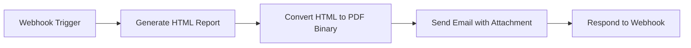

# n8n Workflow — Site Visit PDF & Email Automation

This directory contains the complete, production-ready n8n workflow for the **Voice-First AI Property Scout**.

## 📌 Workflow Overview

When a user approves a property shortlist and books a site visit via voice command or UI interaction, the application triggers this n8n workflow via Webhook.

The workflow automatically:
1. **Listens to Webhook Trigger** (`POST /webhook/site-visit-booked`).
2. **Generates HTML Report**: Formats property metadata, rent prices, BHK details, furnishing status, amenities tags, peak-hour commute times, nearest metro stations, and grounded neighborhood citations into a styled HTML document.
3. **Converts HTML to PDF Binary**: Renders the HTML report into a PDF document attachment.
4. **Dispatches Email**: Sends an email to the user with the generated PDF shortlist dossier attached.
5. **Responds to Backend**: Returns a confirmation payload with status and `booking_id` back to the Voice Agent API.

---

## 🚀 How to Import into n8n

### Option A: Via n8n UI
1. Open your n8n Dashboard (e.g. `http://localhost:5678` or your hosted n8n instance).
2. Click on **Workflows** -> **Add Workflow**.
3. In the top right menu (`...`), select **Import from File**.
4. Upload `workflows/site_visit_pdf_workflow.json`.
5. Configure your **SMTP / Send Email Credentials** in the *Send Email with PDF Attachment* node.
6. Click **Activate Workflow**.

### Option B: Via n8n CLI / API
```bash
n8n import:workflow --input=workflows/site_visit_pdf_workflow.json
```

---

## 📡 Webhook API Specification

* **Endpoint:** `POST https://<your-n8n-instance>/webhook/site-visit-booked`
* **Content-Type:** `application/json`

### Sample Request Payload

```json
{
  "user_name": "Arsh Maheshwari",
  "user_email": "renter@example.com",
  "booking_slot": "Saturday, Aug 15 at 11:00 AM",
  "booking_id": "BK-2026-8921",
  "shortlist": [
    {
      "listing_id": "blr_kora_8921",
      "society_name": "Prestige Acropolis",
      "locality": "Koramangala 3rd Block",
      "city": "Bengaluru",
      "rent_inr": 38000,
      "bedrooms": 2,
      "sqft": 1250,
      "furnishing": "Semi-Furnished",
      "amenities": ["Covered Parking", "Gym", "Power Backup", "24/7 Security"],
      "commute_summary": "12 mins to Sony World Junction (Peak Hour)",
      "nearest_metro": "Indiranagar Metro Station (2.1 km)"
    },
    {
      "listing_id": "blr_hsi_4410",
      "society_name": "Mantri Elegance",
      "locality": "HSR Layout Sector 1",
      "city": "Bengaluru",
      "rent_inr": 34000,
      "bedrooms": 2,
      "sqft": 1180,
      "furnishing": "Fully Furnished",
      "amenities": ["Balcony", "Clubhouse", "Swimming Pool"],
      "commute_summary": "18 mins to Silk Board (Peak Hour)",
      "nearest_metro": "HSR Silk Board Metro (1.4 km)"
    }
  ],
  "neighborhood_citations": [
    "Wikipedia: Koramangala urban character & dining hub",
    "OpenStreetMap MCP: Indiranagar Metro distance matrix (2.1 km)",
    "Bengaluru Namma Metro Transit Guide 2026"
  ]
}
```

---

## 🧪 Testing the Workflow

You can test the workflow directly using `curl`:

```bash
curl -X POST http://localhost:5678/webhook/site-visit-booked \
  -H "Content-Type: application/json" \
  -d '{
    "user_name": "Test User",
    "user_email": "test@example.com",
    "booking_slot": "Sunday at 3 PM",
    "shortlist": [
      {
        "society_name": "Prestige Acropolis",
        "locality": "Koramangala",
        "rent_inr": 38000,
        "bedrooms": 2,
        "sqft": 1250,
        "amenities": ["Parking", "Gym"]
      }
    ]
  }'
```

### Expected Webhook Response

```json
{
  "success": true,
  "message": "Site visit scheduled and PDF report emailed successfully.",
  "booking_id": "BK-2026-8921",
  "recipient": "test@example.com"
}
```

---

## 🛠️ Nodes & Data Flow Diagram



---

## 🔒 Security & Privacy Notes

- All listing data passed to the Webhook **must be pre-sanitized** by the backend (no owner/agent phone numbers or personal PII).
- Use HTTPS for the Webhook endpoint in production.
